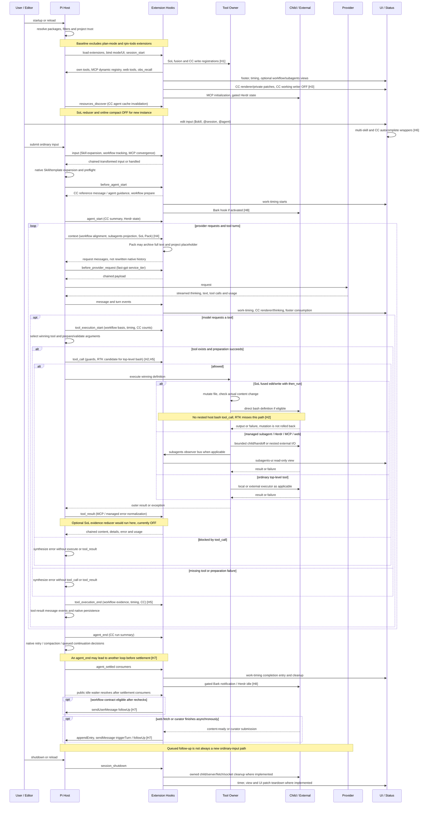

# Local Pi Extension Integration Map

This is a **behavior and ownership map**, not a package introduction or a recommendation to enable every feature. Its baseline is Pi `0.86.0` and the pinned components in the [offline evidence record](../evaluations/2026-09-18-pi-extension-composition-offline.md). Recheck it when those versions or local feature choices change. Individual extension architecture documents still own their contracts; this page owns only cross-extension integration boundaries.

## Read This First

- Disabling SoL **online context compaction does not disable action fusion**. Fusion still competes with CC for `write` and adds `then_run` to whichever fused tools actually win. CC's own write override is independent of SoL. ObservationPack changes later request context, not the write schema/executor.
- **RTK + fusion has an interception gap**, not a demonstrated universal execution failure: the pinned RTK adapter handles top-level `bash`; fused `edit/write.then_run` directly executes a bash definition and does not produce another host `tool_call`. It therefore misses that rewrite path.
- **RTK + ObservationPack is not inherently the same conflict.** RTK filters command output before the tool result exists; Pack later archives and replaces eligible result text in request projections. They can compose, but recall cannot recover data RTK already discarded. Real filtering fidelity and savings remain unverified.
- Configuration changes are not hot removal. SoL registers features once per extension instance at `session_start`; a newly initialized instance must be checked after restart/reload. A running process may still expose `update_plan` or compaction hooks registered before the setting changed. Native Pi compaction and CC's visual “compact” mode are separate mechanisms.

### Evidence Vocabulary and Activation

**C** = allowlisted configuration observation; **S** = fixed local source; **O** = controlled offline host observation; **U** = unverified in the actual user process. Installed → selected → loaded → feature activated → winning owner are separate facts. An exposed tool schema is evidence of that interface, not sufficient owner attribution.

| Component | Selected baseline / gate | Evidence boundary |
| --- | --- | --- |
| First-party package, nine extensions | `plan-mode` excluded; the other eight not excluded by this package selection | C/S; feature gates and mode still apply |
| SoL-Pi | `actionFusion=true`, `observationPack=true`; reducer and online compact false; no project SoL file | C; these are local choices, **all four upstream code defaults are false** |
| pi-cc-extensions | Selected; `enableWorkingMessage=false` | C/S; other feature gates and TUI mode must be checked individually |
| pi-mcp-adapter | Selected; package `skills: []` | C; does not disable the extension, servers, or every possible independent Skill source |
| pi-web-access | Selected | C/S; each tool/provider/curator path has its own configuration |
| rpiv-todo | Installed, package `extensions: []` | C; no active todo writer established |
| Loose Bark / Herdr state integrations | Auto-discovery candidates | S; downstream hook, socket and environment activation not exercised |
| RTK | **Not installed**; pinned adapter candidate only | S/O with CLI stub, not real RTK acceptance |

The global/project settings are not reproduced here. The [evidence record](../evaluations/2026-09-18-pi-extension-composition-offline.md) owns the dated values, source fingerprints, probe limits and reproduction procedure. First-party authored source is this checkout; daily Pi uses its copied local package snapshot, not automatically these working-tree bytes.

## Host Rules That Determine Composition

1. **Same-name tools are not middleware.** Pi's extension runner keeps the first registered definition encountered in resolved extension order. Registering again within one extension replaces that extension's entry; it does not compose wrappers across extensions. `session_start` registration and CC's external-owner check add timing sensitivity. SDK custom tools are another registry input, outside the tested combinations.
2. **Hooks are not all equivalent.** `input` transforms chain and `handled` short-circuits; `before_agent_start` can add messages/change system prompt; `context` chains request-message projections; `before_provider_request` chains payload changes. `tool_call` can mutate input or block, and `tool_result` chains output/error/detail changes. Sharing an event alone does not demonstrate a conflict.
3. **For executed top-level calls, the observed order is** `tool_execution_start → argument preparation/validation → tool_call → execute → tool_result → tool_execution_end → tool-result message events`. The start event is not proof execution happened. Missing tools, blocked calls or preparation failures can reach end without executing or passing through the executed-result hook. Parallel calls can interleave; the diagram describes each call's partial order.
4. **Arguments are validated before `tool_call`.** Later handlers see earlier mutations; the host does not automatically rerun argument validation after a rewrite. A guard's position relative to a mutating adapter matters. Start observers may have captured the pre-rewrite arguments, while end observers see the post-`tool_result` result.
5. **Not every shell/network operation is an agent tool.** Extension `pi.exec`, direct tool-definition execution, managed children and nested MCP calls have their own boundaries. Parent bash hooks cannot be assumed to intercept them. MCP has internal approval logic; “not a separate top-level event” does not mean “no approval.”
6. **Display is a separate plane.** A keyed status is not a footer writer; a widget is not a working-message writer. CC additionally patches component/prototype methods, so an event-only graph would miss integration surfaces.
7. **Settlement is not semantic completion.** Pi owns loop execution, queues, retry/compaction and persistence. `agent_end`, `agent_settled` and public `waitForIdle` describe different host states. An extension may enqueue more work; the main agent still judges task fulfillment.

Source anchors: `PI/core/extensions/{runner,loader}.js`, `PI/core/agent-session.js`, `PI/core/resource-loader.js`, and especially `CORE/agent-loop.js` (`prepareToolCall`, `executePreparedToolCall`, `finalizeExecutedToolCall`). Reading only SDK callback declarations is insufficient to infer dispatch order. Prefixes are defined in the source index below.

## Behavior-Level Mapping

Each row identifies an intervention, its shared target, its activation/side-effect boundary, and the source owner to change. “Off” describes the baseline above, not a claim that an existing process has already unloaded it.

### First-Party Extensions

| ID / owner | Entry point | Changed or observed target | Gate, side effect and composition boundary | Source anchor |
| --- | --- | --- | --- | --- |
| F01 plan-mode: tool profile | `/plan`, `/default`, flag, session restoration; `setActiveTools` | Active tool set | Off by package selection. Read-only profile is not an OS sandbox; multiple active-tool writers would compete | `P/plan-mode/index.ts`: `applyPlanTools` |
| F02 plan-mode: prompt | `before_agent_start` | System-prompt guidance | Only selected plan profile; prose guidance is not mechanical enforcement | `P/plan-mode/index.ts` |
| F03 multi-skill-mentions: editor | `session_start`, `addAutocompleteProvider` | `$skill` completion chain | TUI only; uses Pi's loaded Skill registry, not independent discovery | `P/multi-skill-mentions/index.ts` |
| F04 multi-skill-mentions: input | `input` | Expanded input with explicit Skill content | Transformer ordering matters; skips extension-origin input; no separate Skill executor | `P/multi-skill-mentions/index.ts`: `getMentionedSkills` |
| F05 fast-gpt | command/branch state; `before_provider_request` | Top-level `service_tier` | Changes only supported official Responses correlations after explicit selection; no parent model switch or billing authority | `P/fast-gpt/index.ts` |
| F06 subagents: execution | `csheng_subagent_sessions` | Foreground child execution, managed native/source state, candidates | Trusted host workers; explicit parent apply/close; child tools are not parent tool events; no automatic acceptance | `P/subagents/{index,continuation}.ts` |
| F07 subagents: context/results | `context`, `tool_result`, shutdown | Managed current-record projection, error flag, owned cleanup | Bounded owner facts, not a semantic mission; transform order and lifecycle matter | `P/subagents/continuation.ts`, `context.ts` |
| F08 subagents: publication | `pi.events` observer snapshots | Read-only observer bus | Publishes execution observations; does not delegate completion judgment | `P/subagents/{continuation,observation-hooks}.ts` |
| F09 subagents-ui | observer bus; command/shortcut; `ui.custom` | Floating overlay; optional widget/status | TUI only, view toggled explicitly; optional widget/status/completion entries off by default; no footer/working-row ownership | `P/subagents-ui/index.ts` |
| F10 herdr-handoff | `herdr_handoff`, result/shutdown hooks | Persistent Herdr agent bridge, wait/continuation, worktree evidence | Explicit user request only; external CLI; no fallback, automatic apply or semantic acceptance | `P/herdr-handoff/index.ts` |
| F11 status-footer | TUI `session_start`, `setFooter` | Footer component | **Footer writer**; reads Pi branch, keyed fast-gpt status and MCP counts; does not own those states or working message | `P/status-footer/index.ts` |
| F12 work-timing: live | `before_agent_start`, stream/tool/UI-prompt hooks, clock/resize | `setWorkingMessage` | **Working-row writer**; one compound fused call gets one tool clock, not an independent bash clock | `P/work-timing/index.ts` |
| F13 work-timing: settled | `agent_settled`, entry renderer; shutdown | Context-free completion entry and timer cleanup | TUI only; displays observed duration/tokens, not business completion | `P/work-timing/index.ts` |
| F14 workflow: contract | `csheng_workflow`; `appendEntry` | Branch-local versioned contract | Explicit enrollment; host evidence and agent/user/review declarations remain distinct; no automatic child/apply | `P/workflow/{goal-tool,goal-store}.ts` |
| F15 workflow: input alignment | `input`, message hooks, `before_agent_start`, `context` | Delivered-input generation and alignment reminder | Observes actual prepared input, not guaranteed final wire content after later transformers; unknown provenance is not new permission | `P/workflow/goal-host.ts`, `P/shared/prepared-input.ts` |
| F16 workflow: evidence | `tool_execution_start/end` | Check-start basis and completed host observation | Capture precedes rewrite/execution; end follows result transforms; fusion is one compound observation, not independent bash proof | `P/workflow/goal-host.ts`: `captures`; `observation.ts` |
| F17 workflow: continuation | `agent_settled`, early-armed public waiter | Conditional follow-up or suspension | Only eligible enrolled work; rechecks idle, queue, trust, alignment and progress after consumers settle; Pi remains loop owner | `P/workflow/{goal-host,settlement}.ts` |
| F18 workflow: view | `/workflow-ui`, store subscription | Optional read-only TUI projection | No semantic state ownership, no headless UI, no footer/working-message writer | `P/workflow/goal-ui.ts` |

Current v2 workflow behavior comes from `goal-host.ts`; historical v1 modules and stage documents are not the runtime authority. See [workflow](workflow.md), [subagent execution](subagent-execution.md), [subagents UI](subagents-ui.md) and [Herdr handoff](herdr-handoff.md) for their independent contracts.

### Third-Party and Loose Integrations

| ID / owner | Entry point | Changed or observed target | Gate, side effect and composition boundary | Source anchor |
| --- | --- | --- | --- | --- |
| S01 SoL actionFusion: registration | Once at `session_start`; `registerTool` | Same-name `edit` / `write`, optional `then_run` schema | On in config; winning tool depends on registry ownership; compact switch unrelated | `SOL/index.ts`, `extensions/action-fusion/index.ts` |
| S02 SoL actionFusion: execution | Outer edit/write `execute` | File mutation, then direct bash definition, compound result | Mutation failure skips command; successful mutation is not rolled back on command failure. Content-change check may skip command; do not infer every success ran it | `SOL/extensions/action-fusion/then-run.ts`: `executeMutationThenRun` |
| S03 SoL ObservationPack | `context`; `obs_recall` | Eligible large result projection, runtime archive/ledger | On; successful pure-text results >10 KiB, normally two full projections then placeholder; fail-open packing; native history retained | `SOL/extensions/observation-pack/{index,observation}.ts` |
| S04 SoL evidence reducer | `tool_result` | Selected evidence-bearing result, receipt/archive | **Off**; if enabled, can make an auxiliary provider call and transform result before observers/Pack; receipt-marked results are excluded from Pack | `SOL/extensions/evidence-preserving-reducer/` |
| S05 SoL online compact | `update_plan`, `context`, `before_provider_request`, turn/session hooks | Plan/compaction state, abort/compact/resume scheduling | **Off for new initialization**; independent of fusion/Pack and native Pi compaction; not semantic completion ownership | `SOL/extensions/online-context-compact/extension.ts` |
| C01 CC write metadata | `session_start`, `getAllTools`, `registerTool` | `write` execution metadata for rich diff | Yields to an already visible external write owner; otherwise may hide SoL write schema. `/ccstyle off` is not equivalent to unloading the tool override | `CC/extensions/renderer/tool/diff/index.ts`: `installWriteOverride` |
| C02 CC renderer | `session_start`, stream/tool/compact/tree/shutdown; private patches | Tool cards, grouping, diff, mouse and transcript components | TUI/mode gates; competes on private component methods, not only public hooks; fusion metadata is not automatically CC metadata | `CC/extensions/renderer/{index,default-mode,compact-mode}.ts` and `tool/` |
| C03 CC compact-thinking | stream/tool/session hooks and prototype wrappers | Thinking display/controller state | Visual compaction, not session context compaction; patch installation/ownership depends on host components and mode | `CC/extensions/feature/compact-thinking.ts` |
| C04 CC session references | autocomplete; `before_agent_start` | `@session:` completion and referenced-session custom message | Reads selected history only on matching references; adds context and can expose referenced data to provider | `CC/extensions/feature/reference/index.ts` |
| C05 CC agent mentions | autocomplete; `resources_discover`; `before_agent_start` | `@agent` suggestions and system-prompt instruction | Requires matching agent definitions; requests an `Agent` tool, does **not** implement this repository's managed tool. Actual definitions/Agent owner unverified | `CC/extensions/feature/reference/subagent.ts` |
| C06 CC run summary | `agent_start`, tool start/end, `agent_end` | Tool-count/duration presentation | Counts top-level calls; does not count nested then_run as a separate bash; `agent_end` is earlier than final settlement | `CC/extensions/feature/agent-summary/` |
| C07 CC working message | stream/turn/agent hooks, `setWorkingMessage` | Working row | **Off locally** to avoid competing with work-timing. This flag does not disable C01–C06 | `CC/extensions/feature/shell/working-message.ts` |
| C08 CC chrome/commands | startup/shutdown, command registrations, Markdown transformer | Header, `/context`, aliases, displayed Markdown | Per-feature gates; presentation transforms are not provider-context compression | `CC/extensions/index.ts`, `renderer/markdown-enhance.ts`, `feature/{context,shell/}` |
| C09 CC docked shell patch | `InteractiveMode.prototype.handleBashCommand` wrapper | Flush pending `!` / `!!` UI components | Private UI call path, not agent bash rewrite or an additional tool event | `CC/extensions/feature/shell/flush-docked-bash.ts` |
| M01 MCP lifecycle/registry | session/input/shutdown; runtime event bus | Server/client lifecycle, dynamic tools, prompt commands, status counts | Can connect/start external servers; input may await convergence. Selection and connection are different states | `MCP/index.ts` |
| M02 MCP execution | `mcp` / scripting / direct tool paths | Nested server calls and adapter approvals | Gateway call is not one parent event per nested operation; retain adapter-specific approval/accounting boundary | `MCP/index.ts` and gateway execution modules |
| M03 MCP result normalization | `tool_result` | Error classification | Transformed `isError` affects end observers and later Pack eligibility; no need to claim generic tool-output compression | `MCP/index.ts`: `toolErrorOverride` |
| W01 web tools | registered search/check/fetch/content tools | External research I/O and stored results | Tool/provider/feature-specific gates; `appendEntry` stores bounded references/results | `WEB/index.ts` |
| W02 web background content | async fetch completion, `appendEntry`, `sendMessage` | Content-ready custom message and optional new turn | `triggerTurn:true` can continue the host independently of workflow or SoL; session lifecycle gates callbacks | `WEB/index.ts`: `startBackgroundFetch` |
| W03 web curator | shortcuts/commands/UI completion; follow-up message | Curated content submitted back to agent | Separate follow-up producer; no global business-completion authority | `WEB/index.ts`, curator integration |
| L01 loose Bark | `before_agent_start`, `agent_settled` | Awaited external hook / notification | Up to 5.5 s hook timeout; sends session/cwd and bounded assistant summary. Not a prompt transform, but external side effects and latency matter | `LOOSE/agent-bark.ts` |
| L02 loose Herdr state | session/agent/settled hooks; `herdr:blocked` bus | Environment-gated socket state reports | Working/blocked/idle reporting, not F10 full-agent handoff; actual socket activation untested | `LOOSE/herdr-agent-state.ts` |
| R01 RTK candidate | `session_start` version preflight; `tool_call` for `bash`; `pi.exec` | Mutated top-level bash command and downstream filtered output | Not installed. Rewrite timeout 2 s; supported exit 0/3 plus output may rewrite, otherwise pass through; permissions are outside adapter scope | `RTK/hooks/pi/rtk.ts` |
| D01 rpiv-todo | Package extension filter | No active contribution established | Excluded; do not add a competing task writer to the graph merely because the package is installed | Package selection |

## Combined Sequence Diagram

This is one **merged causal diagram**, not a claim about alphabetical or currently resolved package order. `Hooks` groups all loaded handlers at a boundary; their internal order is Pi's resolved extension order. Conditional/off/candidate paths are named explicitly. UI updates can occur throughout; external work may outlive a tool result. H1–H8 link to the hotspot table below.

The graph locates all selected packages plus disabled/candidate alternatives without asserting that every gated branch runs. It is not a concurrency scheduler: web completion can arrive earlier than shown, multiple tool calls can overlap, and native queue/retry/compaction can repeat provider turns. If SoL online compact is re-enabled, add its abort/compact/resume path to H7 and its context/payload hooks to H4; do not mistake that optional path for native Pi's compaction or CC's display compacting.

### H1: Concrete Write-Owner Outcomes

Observed with the real host and the source leaves, **not** a full installed-session audit:

| Controlled registration/load order | Winning write | write `then_run` | Winning edit |
| --- | --- | --- | --- |
| CC only | CC metadata override | No | Native |
| SoL fusion only | SoL | Yes | SoL |
| CC → SoL | CC | No | SoL |
| SoL → CC | SoL; CC yields | Yes | SoL |

Thus an `edit.then_run` / plain `write` asymmetry is possible without compaction being involved. Reordering is not a general fix: it chooses which write behavior is present and can lose CC execution metadata. Diagnose post-`session_start` `getAllTools()` schema plus `sourceInfo`, resolved extension order, effective flags and mode before changing configuration. Do not infer the current winner solely from settings order or the visual diff card.

## Shared-Target Hotspots and Isolation

| ID | Shared target / risk | What is established | Smallest useful isolation / modification owner |
| --- | --- | --- | --- |
| H1 | `write` registry and execution metadata | S/O: competing CC/SoL definitions; first owner wins, CC may yield | Compare CC-only, SoL-only and both orders in disposable host; fix coordination in CC/SoL owner, not a third first-party write wrapper |
| H2 | Shell interception inside fusion | S/O: bash-only RTK adapter misses then_run; outer guards still apply | Compare ordinary bash with fused call; supported fusion execution boundary belongs to SoL/host. Separate mutation and top-level bash when interception is required; never synthesize observer events as enforcement |
| H3 | UI ownership | S/C: status-footer owns footer, work-timing owns working row, CC working writer disabled; CC also patches components | Disable only competing writer first; component issues require CC/TUI investigation. Overlay/widget/keyed status is not automatically a writer collision |
| H4 | Request context and evidence retention | S/O: Pack is a later projection, not result-time filtering or compaction | Compare same fixture before/after context; verify archive/recall separately from filtering. Pack owns packing; workflow owns evidence binding, not raw-output reconstruction |
| H5 | Argument/result evidence identity | S/O: start before rewrite; result transforms before end; fused mutation may persist on error | Trace pre/post inputs and outer result in a disposable harness. Guards own enforcement; workflow must interpret real available observations conservatively, not certify unobserved nested checks |
| H6 | Editor, input and system prompt | S: Skill mentions, CC references/agent instructions affect different stages | Test explicit mentions with known registries and no real session export. Fix corresponding transformer or portable Skill source; avoid a global catch-all prompt rewrite |
| H7 | Follow-up and completion | S: workflow and web are active-capable producers; SoL compact can be another when enabled | Trace queues, abort, alignment and public idle boundaries; no full co-load race test yet. Do not equate a notification, successful tool result or agent_end with task completion |
| H8 | Out-of-band I/O and awaited latency | S: Bark/Herdr/MCP/web may act without a model-generated bash | Stub external endpoints for ordering tests. Fix the integration owning the I/O; no blanket claim of “observer-only/no side effects” |

For symptom-driven triage: **missing then_run → H1**; **RTK skipped a command → H2**; **working line flickers → H3**; **result disappeared from prompt → H4**; **check evidence looks inconsistent → H5**; **unexpected Agent instruction/context → H6**; **agent keeps going → H7**; **idle is delayed or external activity appears → H8**. Test the smallest implicated pair before disabling the whole stack.

## Where a Daily Change Belongs

| Requested behavior | Durable scope / owner | Avoid |
| --- | --- | --- |
| Short always-loaded `rg`/`fd` preference | Harness-global `AGENTS.md`; repository-specific search policy in project `AGENTS.md` | Loading a large Skill for routine searches; creating another tool override merely to change preference |
| Complex search, structured processing, quoting, COUNT/PREVIEW/EXECUTE judgment | Authored `agent-skills/src/skills/` Skill; regenerate its distribution through that repository | Editing generated Skills or copying semantic rules wholesale into Pi hooks |
| Mechanically decidable command restriction / rewrite | Thin host adapter at the actual execution boundary, with defined nested-call and ordering coverage | Treating prompt guidance, post-result filtering or bash-only interception as a universal security boundary |
| `edit/write.then_run`, queueing, failure semantics | SoL action-fusion implementation and its integration tests | Hiding the failure in workflow or adding another same-name writer |
| Write diff capture / cards / private component patches | CC write-metadata and renderer implementation | Assuming `/ccstyle off` removes its write override, or patching installed npm bytes as durable source |
| Pack thresholds, retained text and recall | SoL observation-pack | Changing workflow to reconstruct text discarded upstream; conflating packing with session compaction |
| Raw-log filtering or RTK command support | RTK binary / its pinned Pi adapter | Expecting ObservationPack to validate RTK semantic fidelity |
| Branch contract, evidence freshness, continuation | First-party `extensions/workflow/`; meaning/acceptance stays with main-agent Skills | Turning another extension into a second semantic lifecycle engine |
| Child routing/execution/candidates | First-party `extensions/subagents/`; route defaults retain their own owner | Giving subagents-ui execution authority or using observer messages as acceptance |
| Footer / working row / observer overlay | `status-footer` / `work-timing` / `subagents-ui`, respectively | Mixing their independent lifecycle or silently changing CC settings from runtime code |
| Mention expansion / request tier | `multi-skill-mentions` / `fast-gpt`, respectively | Folding unrelated prompt, provider selection or billing policy into them |
| Explicit full-agent bridge / state reporting | `herdr-handoff` / loose Herdr integration, respectively | Treating state notifications as authority to launch another agent |
| Package enablement and feature choices | User-owned Pi/package settings; trusted-project override only where supported | Committing machine credentials/settings or assuming checkout edits reach the copied daily package |

These are ownership directions, not new change authorization. Third-party fixes belong in maintained upstream/fork source with pinned versions, not ad hoc installed-file edits. First-party publication still requires explicit authority and the existing local snapshot publisher.

For search specifically, Pi's built-in `grep` uses `rg`; built-in `find` normally uses `fd`, but custom `operations.glob` can replace that executor. Tool names do not imply legacy binaries, and custom `grep` filesystem operations do not replace its search process. Prefer existing short persistent guidance over duplicating it. A project `.pi/APPEND_SYSTEM.md` is selected instead of the global fallback, not automatically merged, so it is not a reliable substitute for an unexamined global preference-loading contract.

## Source Index and Maintenance

Paths below are **source aliases**, not instructions to discover or execute arbitrary installed extensions. Third-party locations describe the inspected installation layout; resolve actual package roots before reproducing. No complete settings, route files, session content or provider selections belong in this map.

| Prefix | Source root / key anchors |
| --- | --- |
| `P/` | Repository `extensions/`; first-party architecture docs and `AGENTS.md` remain authoritative for individual contracts |
| `PI/` | `node_modules/@earendil-works/pi-coding-agent/dist/`; `core/extensions/runner.js`: `getAllRegisteredTools`, `getToolDefinition`, `emitInput`, `emitToolCall`, `emitToolResult`, `emitContext`, `emitBeforeProviderRequest` |
| `CORE/` | This Pi package's nested `node_modules/@earendil-works/pi-agent-core/dist/`; `agent-loop.js` owns actual start/prepare/execute/finalize/end ordering |
| `SOL/` | Installed SoL-Pi `src/sol-pi/`; `index.ts`: `registerConfiguredFeatures`, `createSolPiExtension`; `config.ts`: defaults and trusted overrides |
| `CC/` | Installed npm `pi-cc-extensions/`; `extensions/index.ts` wires feature flags and unconditional render-stack installation |
| `MCP/` | Installed npm `pi-mcp-adapter/`; `index.ts` owns registration, input convergence and result normalization |
| `WEB/` | Installed npm `pi-web-access/`; `index.ts` owns tools, stored entries, background content and curator submission |
| `LOOSE/` | Pi agent directory `extensions/`; `agent-bark.ts`, `herdr-agent-state.ts` |
| `RTK/` | [RTK commit `6d104308c56c0a51250f8a200e5056787128fb65`](https://github.com/rtk-ai/rtk/blob/6d104308c56c0a51250f8a200e5056787128fb65/hooks/pi/rtk.ts), not an installed dependency |

On upgrades, recheck shared targets first: tool ownership/schema, actual event order, context/result transformations, private UI methods, and follow-up semantics. Rerun the [opt-in probe](../../scripts/probe-local-extension-composition.ts) with explicit source paths and preserve its boundary: it does not run real RTK, full CC UI, MCP, web, Bark, Herdr, child models or the user's active process. Stable claims should cite a current source path or bounded observation; unresolved compatibility should stay explicitly unresolved rather than becoming a new global prohibition.
