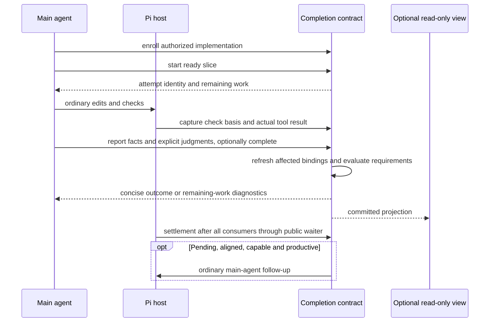
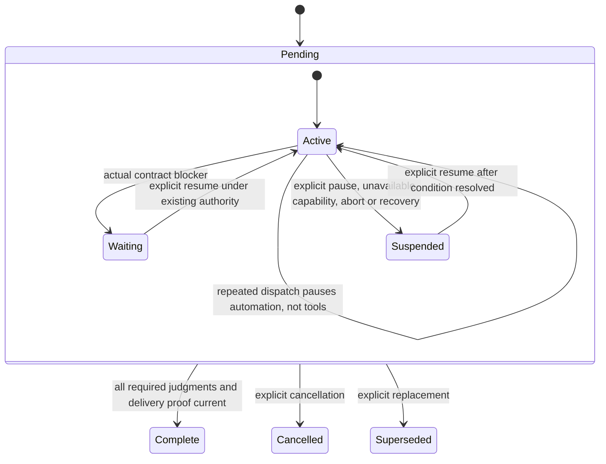

# Goal-Driven Workflow

`extensions/workflow/index.ts` registers `csheng_workflow` as one branch-local, explicitly enrolled **implementation completion contract**. The main agent owns the goal, authority, requirements, work decomposition, evidence interpretation, acceptance and final response. Code owns bounded identities, factual bindings, current-state transitions, input reconciliation, persistence and continuation eligibility. Pi remains the only model/tool loop. Managed subagents remain execution transport; their success or apply never establishes acceptance.

## Enrollment and scope

The main agent enrolls authorized implementation with `enroll`; the runtime does not classify prose or discover Skills. Ordinary analysis, review, questions, plans and todo display do not require a contract. Before enrollment the extension may track ephemeral prepared input, but creates no contract snapshot, arms no workflow idle waiter and requests no continuation. There is no second ordinary-task ledger. Portable Skills remain optional semantic guidance, never imported runtime dependencies.

The main agent projects independently deliverable plan tasks using stable keys rather than collapsing independent owners into one umbrella task. A task represents an independently verifiable outcome and blocker boundary, not a command or an arbitrary time/file-count budget. Requirements and delivery can retain aggregate acceptance without turning that grouping into a prerequisite for every local join. Dependencies name only outputs actually needed to start and accept a task; neither stage order nor display grouping establishes a dependency. Model-derived decomposition, inferred dependencies and investigation order may be corrected within existing goals, acceptance and authority; user-fixed choices remain binding. Code does not parse the plan, impose task-count heuristics, or certify this semantic projection.

Version two is the only supported workflow protocol and snapshot format. The version-one reducer, replay/migration path, model protocol, automatic-review policy and dedicated fixtures have been removed. An already running Pi process keeps the package version it loaded until explicitly restarted/reloaded.

## Semantic protocol

| Operation | Meaning |
| --- | --- |
| `enroll` | Supply `goal`, `delivery`, existing `authority`, `requirements` and optional `tasks`. Omitted tasks default to one task per requirement. Each requirement has a stable key, outcome and verification; task dependencies reference task keys. |
| `start` | Name a ready task and its filesystem `scope` (actual evidence-source file/directory paths) and optional filesystem `writes` (planned mutation paths). Neither field accepts task-description semantics; prose belongs in goal, task title or report summary. Paths are cwd-relative or explicitly authorized absolute roots. Code allocates an attempt and captures its initial basis. |
| `report` | Resolve an unambiguous running attempt, or explicitly name a reported attempt for a correction. Supply a summary, stable-key facts, explicit judgments and optional `complete` or task-level `blocker`. |
| `amend` | Reconcile a semantic goal, delivery, requirement or task change with reason and authority. Supplied `tasks` replaces the full task list. Split oversized aggregates under existing authority, retaining unrelated keys, coverage and dependencies to preserve their acceptance; new split tasks do not inherit aggregate acceptance. Compatible source drift is not a semantic amendment or new permission. |
| `inspect` | Read bounded current requirements, tasks, facts and judgments. Optional `subject` selects `requirement:<key>`, `task:<key>`, an attempt ID or a fact ID. Unsupported snapshots expose only an unavailable-state diagnostic. |
| `close` | Evaluate completion with `outcome: completed`, or explicitly record cancellation/supersession with a reason. Repeating the same terminal outcome on the current contract is a no-op; completed proof is revalidated first, and conflicting outcomes fail. |
| `suspend` | Record an actual operational reason and explicit resume condition without satisfying unfinished requirements. |
| `resume` | Record the resolved condition and existing authority; explicitly resume waiting/suspended work after reconciliation. |

A normal slice uses `start`, ordinary tools, then one compound `report`, not model-authored revision checks and separate record/assessment calls. Revisions and transaction ownership are internal. Mutation receipts contain state, running attempt IDs, bounded diagnostics and outstanding subjects rather than full snapshots. Pending contracts also expose a task-local frontier: `Ready`, task-local `Blocked` reasons and `Waiting on dependencies`. Each category shows at most six entries, dependency hints at most four keys and blocker reasons at most 160 characters; omissions direct the agent to inspect. Accepted tasks are omitted, running tasks are not also listed as ready, and terminal contracts expose no ready list. Readiness is a derived graph fact, not authority or permission to resume a suspended/unaligned contract. Failed operations return the stored state without committing tentative source revalidation, so their receipts withhold the frontier and direct the agent to `inspect` before choosing the next task. Dependency rejection identifies missing predecessor keys and points to independent work or a factual split via amendment, not acceptance bypass. `inspect` provides the larger projection and individual record selection. Stable fact keys replace earlier facts on correction; repeated host call identities are deduplicated with bounded opaque digests.

Report facts distinguish `host`, `agent`, `user` and `review` provenance. Omitted host `observationId` binds the latest completed captured result for that attempt; explicit references disambiguate multiple checks. Judgments name `task:<key>`, `requirement:<key>` or `delivery`, reference fact keys and provide a rationale. A fact may support several explicitly judged subjects; coverage alone never accepts them. Authentic failed checks, incomplete proof, stale evidence, overlapping writers and remaining requirements are normal report diagnostics, not reasons to retry an unchanged tool payload. Malformed requests, fabricated observations, unknown subjects, invalid transitions or uncommitted preparation fail without mutation. A native `ENAMETOOLONG` during start-path validation returns bounded `invalid_scope` guidance rather than an apparent unavailable contract or a raw path dump. This does not infer prose from spelling or impose a new path-length heuristic: legal spaces, Unicode, missing planned targets and external roots retain their existing behavior. A short sentence can still be a legal missing path, so the agent must inspect and correct narrative scope declarations and reverify their affected evidence; the runtime cannot certify their meaning.

`start`, `report`, and `inspect` expose bounded model-visible references: contract ID/revision/input generation, recent attempt IDs, usable fact IDs, and captured observation IDs. Missing fact, attempt, and host-observation diagnostics include current bounded choices; they do not infer or substitute evidence. Terminal child execution with failed finalization cannot certify a passing host fact.

## Evidence, drift and completion

A host fact requires an actual non-workflow tool completion or owned asynchronous terminal observation, with the corresponding check-start scope captured while its attempt was running. This permits the normal edit-then-test path without retroactively treating the initial source as the tested source. No captured basis means unavailable evidence. A failed host/managed result cannot certify a passing fact. Declared evidence stays declared and binds the initial attempt basis; reading a file is not silently relabeled an executed test. Managed observations contain only the bounded public envelope and do not inspect a child's private state.

Declared scopes and write surfaces resolve against the invocation cwd; local declarations retain their relative form and explicit external declarations retain absolute paths. Source repositories and bounded non-Git installation targets are supported without a second allowlist. Missing paths bind through their nearest existing ancestor. Fingerprints bind the declaration location, content and physical alias identity; identical bytes in a copied checkout are not old evidence. Overlap uses both declared and physical endpoints and the source's intermediate link dependencies: installation-parent or chained-link replacement conflicts, but sibling writes that merely share a link do not. Local `.` cannot block an unrelated external root. Symlink targets resolve in filesystem order before parent traversal, including dangling ancestors. Explicit installation-link leaves certify their link/target identity without recursively scanning an undeclared external target; declare target content separately when it supports acceptance. Recursive scans refuse undeclared escaping links and directory-link traversal. Path declarations are evidence and conflict surfaces, not OS isolation or an authorization source. Session start/tree recovery revalidates even completed snapshots before mounting their projection; inspect also refreshes evidence. A copied or changed root cannot inherit old completion, and lost completed evidence becomes pending/suspended for reconciliation rather than silently resuming. Existing bounded fingerprinting limits file count, bytes and depth; unavailable basis never means unchanged. Fingerprints are recomputed before judgments, completion and continuation. Source drift invalidates dependent judgments and delivery proof, preserves unaffected acceptance, and calls for affected re-verification rather than a permission round-trip. A changed requirement or dependency revokes affected judgments and interrupts obsolete execution bindings, including already reported attempts. Previously recorded facts remain usable when their own source and provenance are still valid, but they do not automatically prove revised meaning. A current attempt must explicitly judge that support; an old raw observation cannot be relabeled as a fresh execution, and an obsolete writer cannot publish new facts. Set-equivalent coverage/dependency ordering preserves acceptance; changed obligations and new split tasks require new judgments rather than copied acceptance. Acceptance is deferred while another running attempt's declared writes overlap the supporting scope.

Completion requires aligned input, explicit acceptance of every required requirement and every active task, no unresolved running attempt, current passing supporting facts, explicit delivery acceptance and no blocked task. The extension cannot prove that the main agent projected every user requirement or interpreted a check correctly. It enforces the enrolled contract, not arbitrary hidden intent.

For managed v3 submissions, `csheng-workflow-execution-binding` persists the dispatch-time contract, attempt bases, input generation and owner. Accepted receipts are not host completion evidence. Terminal-before-receipt, duplicate events and late siblings reconcile by run/episode identity, never by whichever attempt happens to be current. Terminal bookkeeping still resolves after aligned new input while evidence retains its original generation. Execution-bearing inspect/join uses the original episode capture; absent/recovered/mixed bindings or a different enrollment cannot become fresh execution proof.

## Fulfillment and continuation

Fulfillment (`pending`, `complete`, `cancelled`, `superseded`) is independent of continuation (`active`, `waiting`, `suspended`). Waiting on a real authority, decision, prerequisite, capability, conflict, non-convergence condition or admitted asynchronous execution does not satisfy the goal. A task blocker names both the reason and unblock condition. Independent ready work remains active; continuation waits only when the remaining tasks cannot advance. `resume` can clear one named task's resolved blocker or explicitly resume the whole contract. The tool guidance distinguishes local blockers from a real user pause or operational inability to continue. Unfinished implementation, classification or review, and the end of one slice, are remaining work rather than suspension reasons. This is semantic guidance, not a new suspension gate: explicit pause, abort, recovery and capability failures still suspend unfinished work, and the extension cannot authenticate a free-form suspension reason merely from task readiness. The automatic-dispatch guard is separate: `automaticPaused` can stop repeated follow-ups while the contract remains active and authorized diagnostic tools remain usable.

Pending execution blocks fulfillment. If all remaining ready work depends on pending children, `executionPending` and `waitingFor` record event-driven waiting without consuming anti-spin progress or issuing polling turns. Independent ready tasks may continue. The executor owns terminal wake; workflow does not send a second completion turn or accept the result. Recovery clears execution waits and suspends rather than resuming jobs.

There is no zero-or-one total continuation allowance. After successful settlement, an aligned active contract may request another main-agent interaction if incomplete work remains. Progress is measured from accepted subjects and distinct usable fact basis/result/provenance plus a bounded host-grounded check signature. Actual check inputs and structured exit/error outcomes distinguish substantive checks on unchanged source. Timing controls, free-form output changes, managed execution IDs, usage, new attempts, prose, observation IDs, model check labels and repeated facts do not independently renew continuation. Unknown output-only diagnostic novelty is conservatively unclassified; its semantic interpretation remains with the main agent. Neither active no-op `resume` nor a suspend/resume cycle resets anti-spin history. Two repeated unchanged progress signatures after the previous dispatch set `automaticPaused` with a diagnostic reason; unchanged settlements then avoid snapshot churn. New relevant evidence can restore automatic dispatch, while ordinary authorized investigation, failed diagnostics and work on independent tasks do not require a resume ritual. This guard limits repeated dispatch, not task lifetime or semantic exploration, and does not use task-count reduction as a progress rule. Genuine suspension never fabricates completion.

The public `csheng-workflow-wait` command is nonce-protected and arms only for an aligned, active, pending contract, without awaiting its idle wait from the event. Store changes also arm it when enrollment or resume occurs mid-turn. Ordinary questions with no contract or a completed/suspended contract create no workflow waiter. The implementation shares the public barrier helper with subagent notification delivery; the subagent-only compaction lease does not change workflow continuation policy. The callback runs only after Pi's settlement consumers finish. The runtime rechecks input/owner/cancellation, mode, trust, active tool availability, idle and pending queues after asynchronous freshness work and before ordinary `sendUserMessage`. It adds no timers, alternate model loop, child dispatch, automatic apply, replay or recovery. Missing/unarmed capability, print/JSON modes, abort and provider error leave unfinished work suspended. A new real receipt invalidates a pending dispatch; branch/session replacement drops ephemeral observations.

## Prepared input and recovery

Only new native user-message occurrences participating in the public pre-provider `context` hook advance input generation. Receipt text, withdrawn/replaced drafts, retries and history do not become intent. The shared prepared-input tracker distinguishes unambiguous ordinary extension controls from human or unknown-origin input without matching receipt text or guessing queue order. Queued/mixed provenance on Pi 0.86.0 remains unknown: ask the main agent to reconcile actual context under existing authority, never infer new permission. Pass an `alignment` explanation in a semantic operation. Snapshot append failure keeps the occurrence pending and fences sensitive commits until preparation succeeds. This hook observes participation, not the final wire content after arbitrary other extensions rewrite context.

Each committed mutation appends one schema-v2 `csheng-workflow-state` snapshot before installing its in-memory projection. Async preparation works on a private copy; owner, input and abort fences are rechecked before commit. Append failure returns `persistence_failed` without installing the proposed state; view failure cannot roll back a committed snapshot. There is no extra state file, global config or cross-session mission service. Cumulative requirements, tasks, attempts, facts, acceptance and idempotency records have no bookkeeping lifetime ceiling, and valid snapshots are not rejected by a cumulative byte threshold. Full call history and pending execution identities are retained rather than silently truncated. Report batches, scope/write/artifact lists, individual field sizes, fingerprint work, ephemeral observations and model-visible projections remain bounded to limit individual operation or output cost; structural validation, references and provenance remain mandatory. Full-snapshot append and replay costs still grow with history; this is not an archival backend, automatic history deletion or an unlimited-resource guarantee.

The newest active-branch snapshot is authoritative. Malformed, counter-inconsistent or unsupported state is unavailable, with no fallback to an earlier accepted snapshot. Version-one snapshots are unsupported, including previously valid snapshots: they expose an unavailable-state diagnostic and block mutation without migration, fallback or session-history rewriting. To use the current contract, explicitly select a new branch/session without an unsupported latest snapshot and enroll the authorized work there; the extension does not create that replacement automatically. Existing v2 snapshots retain any inert `legacy` identity/revision provenance written by the retired migrator, without loading a v1 reader or treating that metadata as fresh proof. Restart/tree replacement interrupts copied running attempts, clears ephemeral observations and requires explicit alignment/resume, never automatic work restart. Removing the extension leaves inert history.

## Optional projection

The TUI view is enabled by default and appears when a contract or recovery diagnostic exists; an empty branch mounts no widget. Manual hide survives state updates, and a fresh extension load restores the default. `/workflow-ui` toggles it; `show` and `hide` control visibility, and `list` uses the host's scrollable read-only selection view. The above-editor widget explicitly labels `accepted/total accepted`, with room-dependent running/reported counts, followed by one read-only task projection shared with the list. Pending tasks use `○`, running tasks `◐`, reported/awaiting acceptance tasks `◇`, interrupted or stale tasks `↻`, blocked tasks `!`, and accepted tasks `✓` with actual dim-gray strikethrough titles. Revoking accepted work interrupts its existing attempts so a dependent still needs a new judgment after its predecessor is reaccepted; unchanged facts may support that explicit judgment without rerunning the original check. Completion counts require current explicit task acceptance; a count alone does not certify delivery. Tracker suspension/waiting, automatic-dispatch pause and input alignment are warnings separate from task blockers, with count and task visibility reserved before optional reason text at narrow dimensions. Neither UI progress nor natural slice-boundary reporting weakens acceptance or adds another ledger. Blocker/dependency hints are secondary to task titles, and long keys are clipped. The widget uses at most 120 columns and one third of terminal height (up to 12 content rows), with active/blocked work prioritized on overflow and a `/workflow-ui list` hint for remaining rows. The list retains all current task rows. Width clipping is display-only. Controls do not enroll, change acceptance, resume work or supply model context. RPC, print and JSON mount no view. There is no footer or working-message writer; UI failure disables only the view.

## Verification boundary

`tests/workflow-goal.test.ts` owns semantic transitions, long-history growth and replay, retained-fact rejudgment, evidence/drift, unsupported-v1 fail-closed behavior, v2 provenance preservation, append failure, suspension and pure projection invariance. `tests/workflow-goal-ui.test.ts` checks default display on enrollment and replay, themed widget mounting, empty-branch cleanup, manual visibility controls, headless inactivity and failure isolation. `tests/workflow-goal-ui-render.test.ts` checks task-tree presentation, acceptance-driven progress, absence of protocol receipts, overflow priority, title preservation and terminal-safe bounded rendering. `tests/workflow-goal-host.test.ts` owns real-host registration, schema, ordinary-work controls, check-time basis, queue preparation, automatic-dispatch pause with continued failed/novel diagnostics, and three productive continuations through fulfillment on unchanged source. Co-load and installed-CLI synthetic-provider fixtures exercise the default v2 entry alongside subagents, observer, timing and footer. `tests/workflow-evidence.test.ts` retains shared fingerprint and bounded-observation coverage; `tests/workflow-provider-schema.test.ts` exercises the actual v2 tool through both Responses serializers using injected offline transports and rejects retired v1 inputs. V1-only tests and their historical extension/TUI fixtures are removed. Both workflow package probes use semantic enrollment with disposable settings and a synthetic provider.

The repository SDK baseline is Pi 0.86.0; installed-host probes also cover actual Pi 0.86.1. `tests/workflow-progress.test.ts` drives real store reporting, suspension and dependency invalidation; `tests/workflow-progress-tui.test.ts` verifies dark/light terminal RGB plus SGR 9/29 in widget, freshly selected/unselected list rows, and disposable-host reload/replay, including an environment where ambient Chalk suppresses strike. The TUI-only fallback does not alter global Chalk, terminal configuration, or headless output. These tests establish host/protocol correctness, not real-model requirement completeness, total inference savings or reduced task abandonment. Publication to the copied daily package, user restart/load and bounded live effectiveness evaluation remain separate authorized actions. For dated source-delivery evidence and milestone limits, see `$AGENT_ARCHITECTURE_DIR/docs/plans/pi-integration/README.md`, which registers the adaptive-goal-protection plan, and `$AGENT_ARCHITECTURE_DIR/archived/README.md`, which describes the retired original workflow plan.
