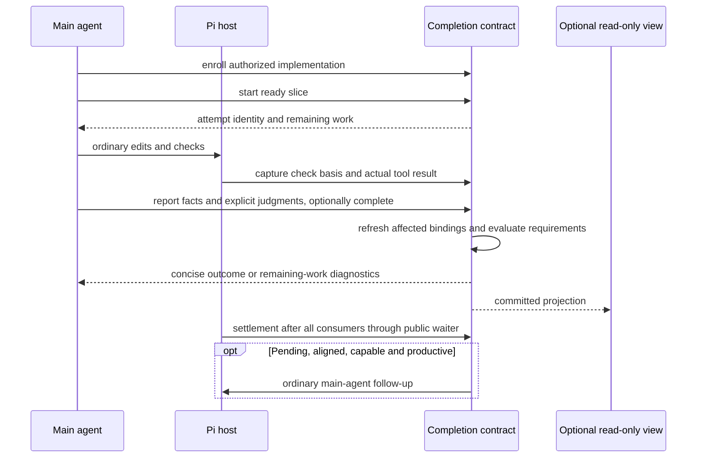
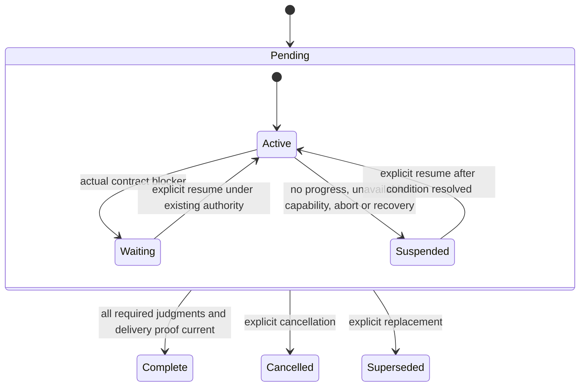

# Goal-Driven Workflow

`extensions/workflow/index.ts` registers `csheng_workflow` as one branch-local, explicitly enrolled **implementation completion contract**. The main agent owns the goal, authority, requirements, work decomposition, evidence interpretation, acceptance and final response. Code owns bounded identities, factual bindings, current-state transitions, input reconciliation, persistence and continuation eligibility. Pi remains the only model/tool loop. Managed subagents remain execution transport; their success or apply never establishes acceptance.

## Enrollment and scope

The main agent enrolls authorized implementation with `enroll`; the runtime does not classify prose or discover Skills. Ordinary analysis, review, questions, plans and todo display do not require a contract. Before enrollment the extension may track ephemeral prepared input and arm the protected public idle waiter, but creates no contract snapshot and requests no continuation. There is no second ordinary-task ledger. Portable Skills remain optional semantic guidance, never imported runtime dependencies.

Version two is the only supported workflow protocol and snapshot format. The version-one reducer, replay/migration path, model protocol, automatic-review policy and dedicated fixtures have been removed. An already running Pi process keeps the package version it loaded until explicitly restarted/reloaded.

## Semantic protocol

| Operation | Meaning |
| --- | --- |
| `enroll` | Supply `goal`, `delivery`, existing `authority`, `requirements` and optional `tasks`. Omitted tasks default to one task per requirement. Each requirement has a stable key, outcome and verification; task dependencies reference task keys. |
| `start` | Name a ready task and its declared `scope` and optional `writes`. Code allocates an attempt and captures its initial basis. |
| `report` | Resolve an unambiguous running attempt, or explicitly name a reported attempt for a correction. Supply a summary, stable-key facts, explicit judgments and optional `complete` or task-level `blocker`. |
| `amend` | Reconcile a semantic goal, delivery, requirement or task change with reason and authority. Compatible source drift is not a semantic amendment or new permission. |
| `inspect` | Read bounded current requirements, tasks, facts and judgments. Optional `subject` selects `requirement:<key>`, `task:<key>`, an attempt ID or a fact ID. Unsupported snapshots expose only an unavailable-state diagnostic. |
| `close` | Evaluate completion with `outcome: completed`, or explicitly record cancellation/supersession with a reason. |
| `suspend` | Record an actual operational reason and explicit resume condition without satisfying unfinished requirements. |
| `resume` | Record the resolved condition and existing authority; explicitly resume waiting/suspended work after reconciliation. |

A normal slice uses `start`, ordinary tools, then one compound `report`, not model-authored revision checks and separate record/assessment calls. Revisions and transaction ownership are internal. Mutation receipts contain state, running attempt IDs, bounded diagnostics and outstanding subjects rather than full snapshots. `inspect` provides the larger projection and individual record selection. Stable fact keys replace earlier facts on correction; repeated host call identities are deduplicated with bounded opaque digests.

Report facts distinguish `host`, `agent`, `user` and `review` provenance. Omitted host `observationId` binds the latest completed captured result for that attempt; explicit references disambiguate multiple checks. Judgments name `task:<key>`, `requirement:<key>` or `delivery`, reference fact keys and provide a rationale. A fact may support several explicitly judged subjects; coverage alone never accepts them. Authentic failed checks, incomplete proof, stale evidence, overlapping writers and remaining requirements are normal report diagnostics, not reasons to retry an unchanged tool payload. Malformed requests, fabricated observations, unknown subjects, invalid transitions or uncommitted preparation fail without mutation.

## Evidence, drift and completion

A host fact requires an actual non-workflow tool completion or owned asynchronous terminal observation, with the corresponding check-start scope captured while its attempt was running. This permits the normal edit-then-test path without retroactively treating the initial source as the tested source. No captured basis means unavailable evidence. A failed host/managed result cannot certify a passing fact. Declared evidence stays declared and binds the initial attempt basis; reading a file is not silently relabeled an executed test. Managed observations contain only the bounded public envelope and do not inspect a child's private state.

Declared scopes and write surfaces are normalized workspace-relative paths, including physically contained aliases and missing paths whose nearest existing ancestor is inside the workspace. Fingerprints retain declared alias identity and its current physical target; retargeting a contained symlink cannot keep old proof current. Overlap checks separately resolve physical aliases. External/escaping paths are refused. Existing bounded fingerprinting limits file count, bytes and depth; unavailable basis never means unchanged. Fingerprints are recomputed before judgments, completion and continuation. Source drift invalidates dependent judgments and delivery proof, preserves unaffected acceptance, and calls for affected re-verification rather than a permission round-trip. A changed requirement or dependency invalidates its task and transitive dependents; all affected execution bindings, including already reported attempts, become obsolete and cannot recycle old facts as proof of revised meaning. Acceptance is deferred while another running attempt's declared writes overlap the supporting scope.

Completion requires aligned input, explicit acceptance of every required requirement and every active task, no unresolved running attempt, current passing supporting facts, explicit delivery acceptance and no blocked task. The extension cannot prove that the main agent projected every user requirement or interpreted a check correctly. It enforces the enrolled contract, not arbitrary hidden intent.

For managed v3 submissions, `csheng-workflow-execution-binding` persists the dispatch-time contract, attempt bases, input generation and owner. Accepted receipts are not host completion evidence. Terminal-before-receipt, duplicate events and late siblings reconcile by run/episode identity, never by whichever attempt happens to be current. Terminal bookkeeping still resolves after aligned new input while evidence retains its original generation. Execution-bearing inspect/join uses the original episode capture; absent/recovered/mixed bindings or a different enrollment cannot become fresh execution proof.

## Fulfillment and continuation

Fulfillment (`pending`, `complete`, `cancelled`, `superseded`) is independent of continuation (`active`, `waiting`, `suspended`). Waiting on a real authority, decision, prerequisite, capability, conflict, non-convergence condition or admitted asynchronous execution does not satisfy the goal. A task blocker names both the reason and unblock condition. Independent ready work remains active; continuation waits only when the remaining tasks cannot advance. `resume` can clear one named task's resolved blocker or explicitly resume the whole contract.

Pending execution blocks fulfillment. If all remaining ready work depends on pending children, `executionPending` and `waitingFor` record event-driven waiting without consuming anti-spin progress or issuing polling turns. Independent ready tasks may continue. The executor owns terminal wake; workflow does not send a second completion turn or accept the result. Recovery clears execution waits and suspends rather than resuming jobs.

There is no zero-or-one total continuation allowance. After successful settlement, an aligned active contract may request another main-agent interaction if incomplete work remains. Progress is measured from accepted subjects and distinct usable fact basis/result/provenance plus a bounded host-grounded check signature. Actual check inputs and structured exit/error outcomes distinguish substantive checks on unchanged source. Timing controls, free-form output changes, managed execution IDs, usage, new attempts, prose, observation IDs, model check labels and repeated facts do not independently renew continuation. Unknown output-only diagnostic novelty is conservatively unclassified; its semantic interpretation remains with the main agent. Active no-op `resume` cannot reset anti-spin history. Two repeated unchanged progress signatures after the previous dispatch suspend automatic continuation with a reason and explicit resume condition. Productive work can continue repeatedly; suspension never fabricates completion. Snapshot/record limits remain hard bounded conditions, not permission to delete requirements.

The public `csheng-workflow-wait` command is nonce-protected and armed during `agent_start` without awaiting its idle wait from the event. The callback runs only after Pi's settlement consumers finish. The runtime rechecks input/owner/cancellation, mode, trust, active tool availability, idle and pending queues after asynchronous freshness work and before ordinary `sendUserMessage`. It adds no timers, alternate model loop, child dispatch, automatic apply, replay or recovery. Missing/unarmed capability, print/JSON modes, abort and provider error leave unfinished work suspended. A new real receipt invalidates a pending dispatch; branch/session replacement drops ephemeral observations.

## Prepared input and recovery

Only new native user-message occurrences participating in the public pre-provider `context` hook advance input generation. Receipt text, withdrawn/replaced drafts, retries and history do not become intent. The shared prepared-input tracker distinguishes unambiguous ordinary extension controls from human or unknown-origin input without matching receipt text or guessing queue order. Queued/mixed provenance on Pi 0.86.0 remains unknown: ask the main agent to reconcile actual context under existing authority, never infer new permission. Pass an `alignment` explanation in a semantic operation. Snapshot append failure keeps the occurrence pending and fences sensitive commits until preparation succeeds. This hook observes participation, not the final wire content after arbitrary other extensions rewrite context.

Each committed mutation appends one bounded schema-v2 `csheng-workflow-state` snapshot before installing its in-memory projection. Async preparation works on a private copy; owner, input and abort fences are rechecked before commit. View failure cannot roll back a committed snapshot. There is no extra state file, global config or cross-session mission service. Limits include 32 requirements, 64 tasks, 256 attempts/facts and a 512 KiB state ceiling; old call IDs and ephemeral observations have bounded retention.

The newest active-branch snapshot is authoritative. Malformed, counter-inconsistent or unsupported state is unavailable, with no fallback to an earlier accepted snapshot. Version-one snapshots are unsupported, including previously valid snapshots: they expose an unavailable-state diagnostic and block mutation without migration, fallback or session-history rewriting. To use the current contract, explicitly select a new branch/session without an unsupported latest snapshot and enroll the authorized work there; the extension does not create that replacement automatically. Existing v2 snapshots retain any inert `legacy` identity/revision provenance written by the retired migrator, without loading a v1 reader or treating that metadata as fresh proof. Restart/tree replacement interrupts copied running attempts, clears ephemeral observations and requires explicit alignment/resume, never automatic work restart. Removing the extension leaves inert history.

## Optional projection

The TUI view is enabled by default and appears when a contract or recovery diagnostic exists; an empty branch mounts no widget. Manual hide survives state updates, and a fresh extension load restores the default. `/workflow-ui` toggles it; `show` and `hide` control visibility, and `list` uses the host's scrollable read-only selection view. The above-editor widget shows `● Tasks · <goal> (done/total)` followed by themed tree rows, not the tool's internal contract/continuation/input receipt. Pending tasks use `○`, running tasks `◐`, blocked tasks `!`, and accepted tasks `✓` with dimmed strikethrough titles. Completion counts require current explicit task acceptance; a count alone does not certify delivery. Blocker/dependency hints are secondary to task titles, and long keys are clipped. The widget uses at most 120 columns and one third of terminal height (up to 12 content rows), with active/blocked work prioritized on overflow and a `/workflow-ui list` hint for remaining rows. The list retains all task rows within the contract limit. Width clipping is display-only. Controls do not enroll, change acceptance, resume work or supply model context. RPC, print and JSON mount no view. There is no footer or working-message writer; UI failure disables only the view.

## Verification boundary

`tests/workflow-goal.test.ts` owns semantic transitions, evidence/drift, unsupported-v1 fail-closed behavior, v2 provenance preservation, persistence, suspension and pure projection invariance. `tests/workflow-goal-ui.test.ts` checks default display on enrollment and replay, themed widget mounting, empty-branch cleanup, manual visibility controls, headless inactivity and failure isolation. `tests/workflow-goal-ui-render.test.ts` checks task-tree presentation, acceptance-driven progress, absence of protocol receipts, overflow priority, title preservation and terminal-safe bounded rendering. `tests/workflow-goal-host.test.ts` owns real-host registration, schema, ordinary-work controls, check-time basis, queue preparation, repeated no-progress settlement, and three productive continuations through fulfillment on unchanged source. Co-load and installed-CLI synthetic-provider fixtures exercise the default v2 entry alongside subagents, observer, timing and footer. `tests/workflow-evidence.test.ts` retains shared fingerprint and bounded-observation coverage; `tests/workflow-provider-schema.test.ts` exercises the actual v2 tool through both Responses serializers using injected offline transports and rejects retired v1 inputs. V1-only tests and their historical extension/TUI fixtures are removed. Both workflow package probes use semantic enrollment with disposable settings and a synthetic provider.

The supported offline host is Pi 0.86.0. These tests establish host/protocol correctness, not real-model requirement completeness, total inference savings or reduced task abandonment. Publication to the copied daily package, user restart/load and bounded live effectiveness evaluation remain separate authorized actions. See the [approved implementation plan](../plans/changes/2026-09-18-goal-driven-workflow-plan.md) for source-delivery evidence and milestone limits.
