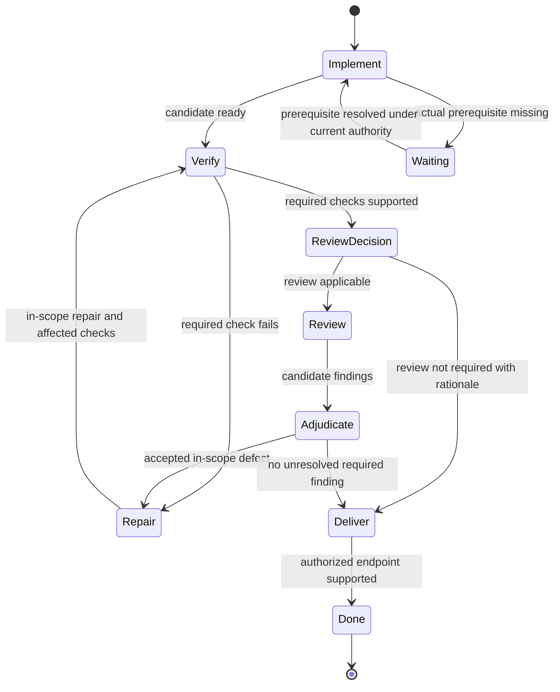
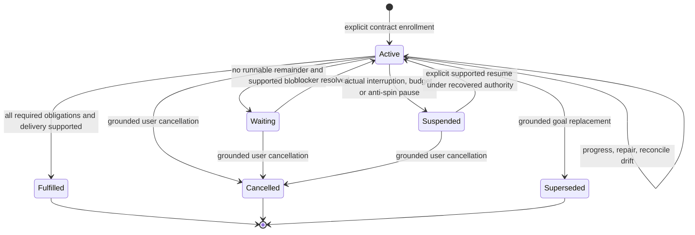
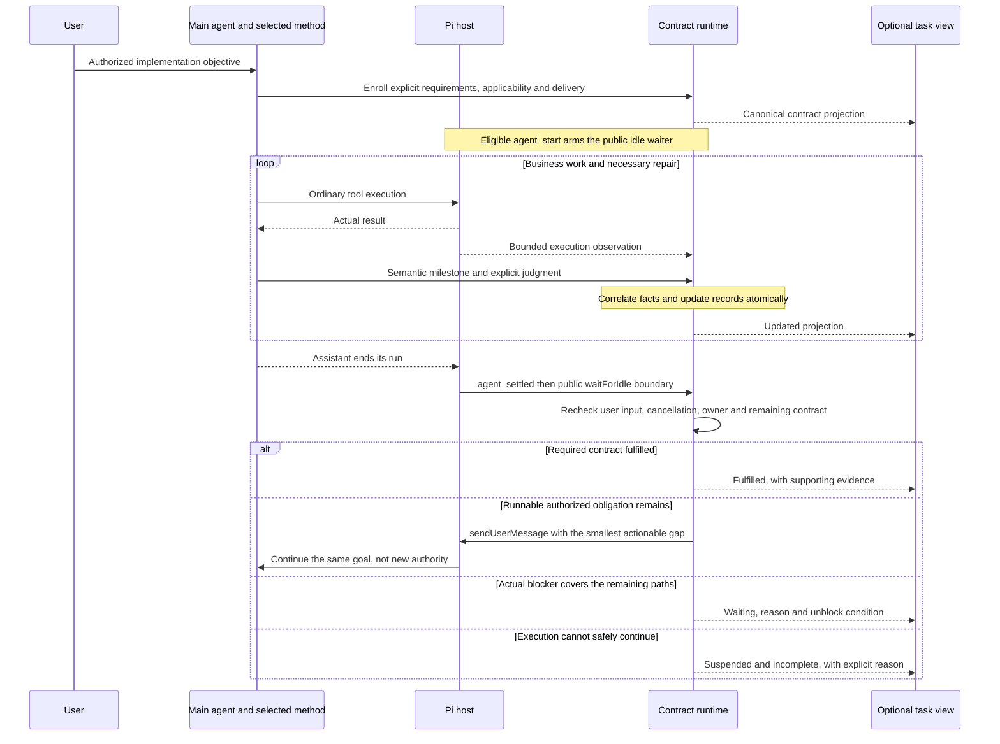
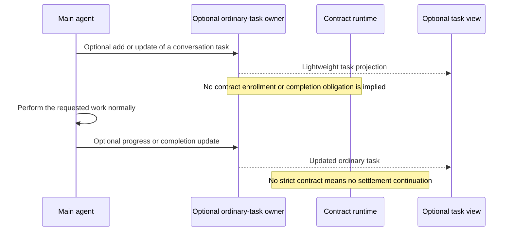
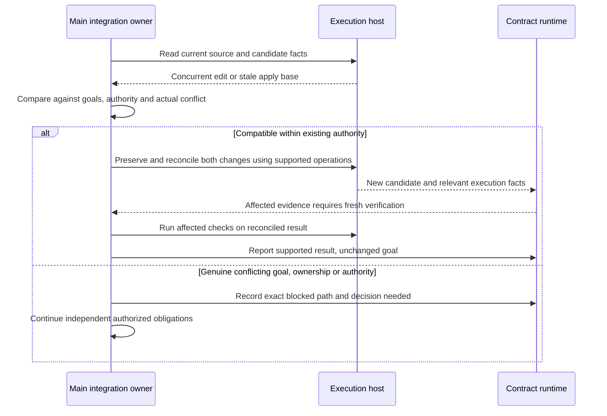

# Goal-Driven Workflow Architecture

## Status and ownership

This is the target architecture, not the installed runtime contract. The user confirmed the direction on 2026-09-18: preserve strict implementation completion, separate ordinary tasks and optional display, reduce model-side bookkeeping, and gate goals rather than incidental planning snapshots. The user subsequently approved E1 source implementation through the [plan](2026-09-18-goal-driven-workflow-plan.md); this target and the [design](2026-09-18-goal-driven-workflow-design.md) retain design rationale. The subsequent `publish , commit and push` request authorizes local snapshot publication and commit/push; daily-process restart/load and live evaluation remain separate. [Current architecture](../../architecture/workflow.md) remains authoritative for implemented behavior.

The user separately authorized necessary portable Skill wording adjustments in `agent-skills`. Those authored changes and their generated projections are documented in the design; they do not install a new Pi runtime or establish live-model effectiveness.

## Protected outcome

An implementation must keep advancing while an evidence-backed action remains inside its approved goals and authority. A final-sounding assistant message, a completed subtask, or a model-invented time/context budget is not completion. Required verification, applicable review, accepted repairs, and the requested authorized delivery endpoint remain obligations. A genuine missing prerequisite or invalid goal premise can stop the affected path; independently actionable work continues.

The runtime can enforce completeness of the explicitly enrolled contract and trace its supporting facts. It cannot independently prove that the main agent enrolled every requirement, correctly interpreted a Skill, or truthfully identified a semantic blocker. `agent_settled` can request another main-agent run after premature settlement; it cannot retract an already emitted final message or guarantee eventual success.

## Boundary decision: a shared contract, not shared implementation

| Option | Consequence | Decision |
| --- | --- | --- |
| Prompt-only portable Skill | Lowest integration cost, but no host-owned check after the model stops. | Keep as the no-capability fallback, not the Pi enforcement mechanism. |
| Main-agent projection into a generic completion contract | Skill supplies semantics; the main agent selects applicable obligations; runtime stores, correlates and checks them. | Selected. This is necessary semantic agreement without a runtime dependency on Skill files. |
| Import or compile `implement-change` into the extension | Can bind an exact method version, but duplicates semantic ownership, creates upgrade coordination and still cannot prove arbitrary business correctness. | Rejected for this scope. Reconsider only for an explicitly requested method-specific execution product with a separate owner and conformance contract. |

Neither repository imports the other. The Skill has no Pi tool names, schemas, provider choices, or runtime hooks. The extension has no Skill scanner, parser, name registry, hardcoded implementation phase list, or version/hash requirement. A method reference may be retained as provenance, never as an immutable permission token. The same generic runtime must accept a differently named method with equivalent completion obligations.

The scarce resource is main-model attention. The selected boundary moves identities, revisions, fact correlation, persistence and replay into code while leaving applicability, acceptance, repair choice, authority interpretation and final response with the main agent. It does not move semantic judgment into hidden runtime heuristics.

## Four distinct kinds of constraint

| Kind | Examples | Response to change |
| --- | --- | --- |
| Goal and authority baseline | Required behavior, verification meaning, authorized side effects, user-fixed technology, an explicitly exclusive write boundary | Reconcile against the actual user/project authority. Obtain a narrow decision if the change exceeds it; do not silently weaken acceptance. |
| Planning context | Expected touch files, observed SHA, helper layout, exploratory environment facts | Refresh from current truth and continue when the approved goal still holds. Approval of the plan does not freeze these observations. |
| Execution precondition | A child's exact write capability, lock ownership, private-source identity, candidate compare-and-apply base | Preserve the guard. The parent can refresh, redispatch or reconcile within existing authority; never force a stale apply. |
| Verification binding | Candidate actually checked, oracle, result and affected scope | Invalidate only unsupported evidence, reconcile the candidate and reverify relevant behavior. Evidence drift is not automatically permission drift. |

File overlap is a coordination fact, not a goal violation. Re-read current contents, preserve unrelated work, reconcile compatible edits and verify the combined result. Git integration, destructive operations and protected branch changes still need their applicable authority. Unresolved ownership or an unsafe conflict pauses affected writes, not every independent task.

## State machine versus dependency graph

This illustrative semantic machine belongs to the Skill and main agent, not to extension code:

Each phase can have cohesive tasks with an acyclic factual dependency graph. Repair is a transition within an obligation, not a reason to add a task or DAG edge on every failed command. A dependency edge expresses order, not authority to bypass parent adjudication. A changed contract can add or retire obligations only under the effective user intent, never to manufacture completion.

The generic contract keeps semantic fulfillment separate from whether the host is currently running:

`Waiting` and `Suspended` remain incomplete. They are not acceptance and do not erase obligations. Runtime suspension does not establish semantic non-convergence or authorize abandoning the goal. A single blocked task cannot stop other runnable required tasks.

## Target sequence: contract execution and settlement

The main agent reports required verification not yet run as unfinished work, not successful completion. A continuation says what business obligation remains, not which attempt/evidence/decision records the model must manufacture. The runtime never chooses shell commands, starts workers, imports candidate files, accepts findings, or runs a second semantic agent.

Repeated productive continuation is not limited to one dispatch per user input. Repeated unchanged settlement is not permission for unbounded inference: the design defines a diagnostic opportunity and a visible anti-spin suspension, separate from business failure. Actual interruption, new human input, branch/session replacement and missing public-wait capability invalidate pending continuations. No timer, hidden retry, restart auto-resume, or approval inferred from an extension message is introduced.

## Ordinary tasks and optional display

The first runtime milestone owns the contract projection, not a second general todo product. Ordinary tasks may stay in conversation or use an independently installed todo extension. An optional future combined view consumes their states without dual-writing them. A contract node's status has one owner: the workflow runtime; copying it into a todo and then reading that copy back as acceptance is prohibited. Hiding or removing the view does not change enrollment, evidence, continuation or completion. Ordinary requests remain the main agent's responsibility even without mechanical enrollment.

New conversation does not automatically enlarge an active contract. Pi input tracking invalidates an obsolete pending continuation immediately; the main agent then reconciles whether the input changes the goal, adds a required obligation, answers a blocker, or is an independent question. The runtime neither guesses semantic intent from message text nor treats every input as fresh permission.

## Target sequence: same-goal parallel drift

## Consequences and verification boundary

The current 21 workflow calls and 9 rejections in the authorized diagnostic work segment establish real protocol friction, not a general model ranking or measured cost saving. The replacement must protect both completion integrity and model attention: multiple premature successful settlements with usable next steps must continue; a plain todo must never acquire this behavior; duplicate bookkeeping must not count as progress; drift recovery must preserve edits and reverify without demanding authority for an unchanged goal.

Deterministic host fixtures can prove these transitions and the exact public-hook ordering. They cannot prove that every real model projects complete requirements or reliably distinguishes a true blocker. A separately authorized bounded effectiveness comparison is required before claiming that long-task abandonment or total inference cost improved. The design and plan keep that limitation visible instead of replacing it with more ledger fields.
